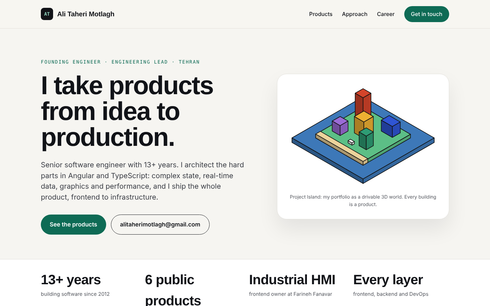
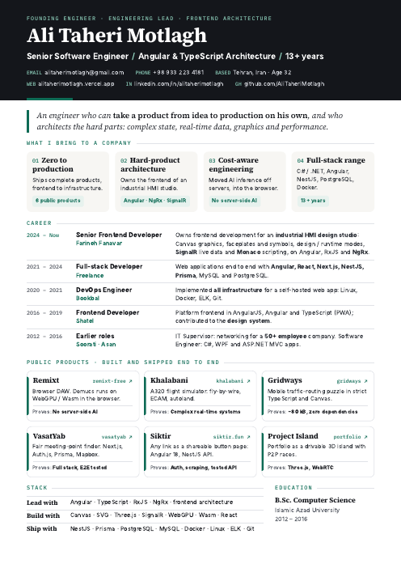
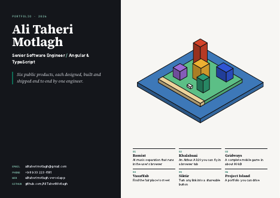

# Ali Taheri Motlagh

**Senior Software Engineer · Angular & TypeScript Architecture · 13+ years**

I take products from idea to production, and architect the hard parts:
complex state, real-time data, graphics and performance.

[**Live site**](https://alitaherimotlagh.github.io/AliTaheriMotlagh-cv/) ·
[Resume (PDF)](./Resume.pdf) ·
[CV (PDF)](./CV.pdf) ·
[Portfolio (PDF)](./Portfolio.pdf) ·
[Showreel (MP4)](./Showreel.mp4)

---

## What's in this repo

| File | What it is | Best for |
|---|---|---|
| [`index.html`](./index.html) | One-page landing site, works on phone and desktop | Sharing a single link |
| [`Resume.pdf`](./Resume.pdf) | 1-page resume | Job applications |
| [`CV.pdf`](./CV.pdf) | 2-page CV with full role detail | Recruiters who ask for a CV |
| [`Portfolio.pdf`](./Portfolio.pdf) | 8-page landscape deck, one page per product | Interviews and screen-sharing |
| [`Showreel.mp4`](./Showreel.mp4) | 44-second 1080p video | LinkedIn and social posts |

<table>
<tr>
<td width="50%" align="center"> Resume</td>
<td width="50%" align="center"> Portfolio</td>
</tr>
</table>

## Showreel

 Click for the full-quality MP4

## What I bring

- **Zero to production:** I design, build, test and deploy complete products, from frontend to infrastructure.
- **Architecture for hard products:** I own the frontend of an industrial HMI design studio, with complex state, live data, graphics and editing.
- **Cost-aware engineering:** I moved AI inference from servers into the user's browser, so the product needs no server-side AI.
- **Full-stack range:** C# / .NET, Angular, NestJS, PostgreSQL, Docker and Linux, across six roles since 2012.

## Public products

| Product | What it does | Built with |
|---|---|---|
| [**Nexus SCADA**](https://nexus-scada.onrender.com/) | Full-stack HMI/SCADA platform with Modbus / MQTT drivers, ISA-18.2 alarms, a historian and a drag-and-drop graphics designer. | TypeScript · Node.js · React · SignalR · SQLite |
| [**Remixt**](https://remixt-free.vercel.app) | Splits a song into vocals and beat, then lets you remix it. The Demucs model runs in the browser on WebGPU / WebAssembly. | Next.js · ONNX Runtime Web · Web Audio |
| [**Khalabani**](https://khalabani.vercel.app) | Airbus A320 and Cessna 172 flight simulator with fly-by-wire, ECAM, MCDU and autoland. | Angular · Three.js |
| [**Gridways**](https://gridways.vercel.app) | Mobile traffic-routing puzzle that ships in ~80 kB with zero runtime dependencies. | TypeScript · Canvas · Vite |
| [**VasatYab**](https://vasatyab.vercel.app) | Finds a fair place for friends to meet. | Next.js · Auth.js · Prisma · Mapbox |
| [**Siktir**](https://siktir-backend.onrender.com/) | Turns any link into a shareable button page. | Angular 18 · NestJS · Prisma |
| [**StreetQuest**](https://streetquest-free.vercel.app) | GPS war game on real streets: build a base where you stand, then breach enemy bases in live first-person matches. | Next.js · Prisma · PostgreSQL · WebGL |
| [**Project Island**](https://alitaherimotlagh.vercel.app) | My portfolio as a drivable 3D island with peer-to-peer races. | Three.js · WebRTC |

## Career

| Years | Role |
|---|---|
| 2024 – now | **Senior Frontend Developer**, Farineh Fanavar: industrial HMI design studio |
| 2021 – 2024 | **Full-stack Developer**, Freelance |
| 2020 – 2021 | **DevOps Engineer**, Bookbal |
| 2016 – 2019 | **Frontend Developer**, Shatel |
| 2015 – 2016 | **IT Supervisor**, Soorati |
| 2012 – 2015 | **Junior Software Engineer**, Asan |

**Education:** B.Sc. Computer Science, Islamic Azad University (2012 – 2016)

**Core stack:** Angular · TypeScript · RxJS · NgRx · Canvas · SignalR · Three.js · WebGPU · React · Next.js · NestJS · PostgreSQL · Docker · Linux

## Contact

Open to **founding-engineer** and **engineering-lead** roles.

- Email: [alitaherimotlagh@gmail.com](mailto:alitaherimotlagh@gmail.com)
- Phone: +98 933 223 4181
- LinkedIn: [linkedin.com/in/alitaherimotlagh](https://www.linkedin.com/in/alitaherimotlagh)
- GitHub: [github.com/AliTaheriMotlagh](https://github.com/AliTaheriMotlagh)
- Based in Tehran, Iran
